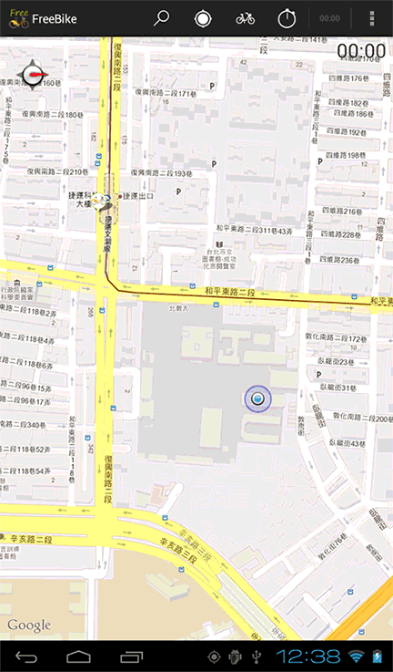

# FreeBike: 2012 to 2013 history

The original 2012 to 2013 development history of FreeBike (FreeBike 台北自由騎), an Android app for YouBike, Taipei's public bike-sharing system. A student team at National Taipei University of Education (國立臺北教育大學) first built it for the 2012 InnoServe Awards during my master's program. The later 2014 version is published separately: https://github.com/huaditsai/freebike-android

**Status: archived historical project, no longer maintained.** It has not been built or tested against current Android versions or online services.

## Award

Second place in the 臺北生活好便利服務創新應用組 category (Taipei convenient living services) of the 17th InnoServe Awards (2012 第十七屆全國大專校院資訊應用服務創新競賽), a national ICT innovation competition for college students in Taiwan. The university lists the team as 蔡華棣 (HuaDi Tsai)、林育陞、王庭筠, advised by 林仁智. This was a team award under faculty supervision, not an individual award.

Sources:

- NTUE newsletter honor roll, page 4: https://academicntue.ntue.edu.tw/var/file/2/1002/img/19/166.pdf
- NTUE Newsletter No. 165 (December 2012), preserved with the later version: https://github.com/huaditsai/freebike-android/blob/master/docs/ntue-newsletter-165-2012-12.pdf
- Project post (Traditional Chinese, 2014): https://dotblogs.com.tw/huadi73/2014/05/16/145145

## Source and history

- Imported on 2026-09-29 from the Team Foundation Version Control (TFVC) project `$/FreeBike` on `huadi.visualstudio.com`. Each TFVC changeset is one git commit with its original author, date, and comment.
- Cleaned before publication: Subversion metadata folders (`.svn/`) left over from the project's earlier Google Code hosting are removed from every commit because they contained a personal email address.
- The layouts still contain old Google Maps Android API v1 keys. Google retired that API version years ago; do not reuse the keys.

## Design files

`design/` holds the team's original 2012 to 2013 artwork, added in September 2026 from a local archive:

- App icons, map pins and toolbar buttons: Photoshop sources (`.psd`) and PNG exports.
- `movie.gif` and `movie.psd`: the in-app demo animation.
- `Map.png` and two variants: Taipei map drafts with hand-drawn station and route annotations.
- `device-2013-05-25-235152.png`: a screenshot from a test device.
- `intro/`: the first-run tutorial overlays (`intro_0.png` to `intro_4.png`), their Photoshop source and three screenshots.

The competition paperwork, APK builds and station data files from the same archive are not included.

## License

No open-source license was found. Do not assume the repository grants any license; third-party libraries keep their own licenses.
